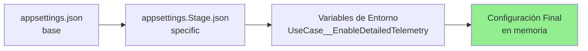

# ?? Configuración de Variables de Entorno - Solución Implementada

## ?? **Problema Resuelto**

Anteriormente, el archivo `appsettings.Stage.json` usaba placeholders `${VARIABLE}` que **NO son soportados nativamente por ASP.NET Core**:

```json
// ? ANTES (NO FUNCIONABA)
{
  "DatabaseSettings": {
    "DefaultConnection": "...Password=${DB_PASSWORD};..."
  }
}
```

Esto causaba que la aplicación intentara conectarse con el string literal `"${DB_PASSWORD}"` en lugar del valor real.

---

## ? **Solución Implementada**

Se implementó la **configuración mediante variables de entorno usando el formato nativo de ASP.NET Core**.

### **Cambios Realizados**

#### **1. Modificación de `appsettings.Stage.json`**

```json
// ? DESPUÉS (FUNCIONA)
{
  "UseCase": {
    "EnableDetailedTelemetry": false
  },
  "DatabaseSettings": {
    "Provider": "SqlServer",
    "DefaultConnection": ""  // ? Valor vacío, se sobrescribe con variable de entorno
  },
  "PaymentBridgeSettings": {
    "Provider": "KiteSolution",
    "Url": "stage.kitexperience.com",
    "SecretKey": ""  // ? Valor vacío, se sobrescribe con variable de entorno
  },
  "APPLICATIONINSIGHTS_CONNECTION_STRING": ""  // ? Valor vacío, se sobrescribe con variable de entorno
}
```

#### **2. Variables de Entorno en Azure Container Apps**

Las variables se configuran usando el **formato de doble guión bajo `__`**, que ASP.NET Core mapea automáticamente a la jerarquía JSON:

| Variable de Entorno | Mapea a (JSON) | Tipo |
|---------------------|----------------|------|
| `ASPNETCORE_ENVIRONMENT` | - | Variable |
| `UseCase__EnableDetailedTelemetry` | `UseCase:EnableDetailedTelemetry` | Variable |
| `DatabaseSettings__DefaultConnection` | `DatabaseSettings:DefaultConnection` | Secret Reference |
| `PaymentBridgeSettings__SecretKey` | `PaymentBridgeSettings:SecretKey` | Secret Reference |
| `APPLICATIONINSIGHTS_CONNECTION_STRING` | `APPLICATIONINSIGHTS_CONNECTION_STRING` | Secret Reference |

---

## ?? **Cómo Funciona**

### **Flujo de Configuración**



### **Ejemplo de Mapeo**

**Variable de entorno:**
```
UseCase__EnableDetailedTelemetry=false
```

**Se mapea a:**
```json
{
  "UseCase": {
    "EnableDetailedTelemetry": false
  }
}
```

**Variable de entorno con secret:**
```
DatabaseSettings__DefaultConnection=secretref:db-connection-string
```

**Azure inyecta el valor real del secret:**
```json
{
  "DatabaseSettings": {
    "DefaultConnection": "Data Source=...;Password=real_password;..."
  }
}
```

---

## ?? **Pasos para Configurar**

### **Opción 1: Usar Script de PowerShell (RECOMENDADO)**

```powershell
# Desde el directorio .Deploy
cd .Deploy
.\configure-env-vars.ps1
```

El script:
- ? Verifica Azure CLI y autenticación
- ? Verifica que el Container App existe
- ? Muestra los secretos configurados
- ? Configura todas las variables de entorno
- ? Muestra resumen de la configuración

---

### **Opción 2: Configuración Manual con Azure CLI**

#### **Paso 1: Crear los Secrets**

```bash
az containerapp secret set \
  --name ca-platheotemplate-stg \
  --resource-group Platheo-tempalte \
  --secrets \
    "db-connection-string=Data Source=platheo-stage-srvbd.database.windows.net;Initial Catalog=BD-Platheo-Template-Stage;User ID=UsrStageAdmin;Password=TU_PASSWORD_REAL;Encrypt=True;TrustServerCertificate=True;Command Timeout=0" \
    "appinsights-connection-string=InstrumentationKey=xxx;IngestionEndpoint=https://xxx" \
    "payment-secret-key=sk_live_xxx"
```

#### **Paso 2: Configurar Variables de Entorno**

```bash
az containerapp update \
  --name ca-platheotemplate-stg \
  --resource-group Platheo-tempalte \
  --set-env-vars \
    "ASPNETCORE_ENVIRONMENT=Stage" \
    "UseCase__EnableDetailedTelemetry=false" \
    "DatabaseSettings__DefaultConnection=secretref:db-connection-string" \
    "PaymentBridgeSettings__SecretKey=secretref:payment-secret-key" \
    "APPLICATIONINSIGHTS_CONNECTION_STRING=secretref:appinsights-connection-string"
```

---

### **Opción 3: Configuración Manual en Azure Portal**

1. **Ir a Azure Portal** ? **Container Apps** ? `ca-platheotemplate-stg`

2. **Settings** ? **Secrets**
   - Crear secret: `db-connection-string`
   - Crear secret: `appinsights-connection-string`
   - Crear secret: `payment-secret-key`

3. **Settings** ? **Environment variables**
   - Agregar variable: `ASPNETCORE_ENVIRONMENT` = `Stage`
   - Agregar variable: `UseCase__EnableDetailedTelemetry` = `false`
   - Agregar variable: `DatabaseSettings__DefaultConnection` ? Reference secret: `db-connection-string`
   - Agregar variable: `PaymentBridgeSettings__SecretKey` ? Reference secret: `payment-secret-key`
   - Agregar variable: `APPLICATIONINSIGHTS_CONNECTION_STRING` ? Reference secret: `appinsights-connection-string`

4. **Click en "Save"**

---

## ?? **Verificación**

### **1. Verificar Variables Configuradas**

```bash
# Ver todas las variables de entorno
az containerapp show \
  --name ca-platheotemplate-stg \
  --resource-group Platheo-tempalte \
  --query "properties.template.containers[0].env" \
  -o table

# Ver solo variables críticas
az containerapp show \
  --name ca-platheotemplate-stg \
  --resource-group Platheo-tempalte \
  --query "properties.template.containers[0].env[?name=='ASPNETCORE_ENVIRONMENT' || name=='UseCase__EnableDetailedTelemetry']" \
  -o table
```

**Resultado esperado:**
```
Name                               Value              SecretRef
---------------------------------  -----------------  -------------------------
ASPNETCORE_ENVIRONMENT             Stage              
UseCase__EnableDetailedTelemetry   false              
DatabaseSettings__DefaultConnection                   db-connection-string
PaymentBridgeSettings__SecretKey                      payment-secret-key
APPLICATIONINSIGHTS_CONNECTION...                     appinsights-connect...
```

---

### **2. Verificar Secrets**

```bash
az containerapp secret list \
  --name ca-platheotemplate-stg \
  --resource-group Platheo-tempalte \
  -o table
```

**Resultado esperado:**
```
Name                              
----------------------------------
db-connection-string
appinsights-connection-string
payment-secret-key
```

---

### **3. Verificar Aplicación**

```bash
# Obtener URL
APP_URL=$(az containerapp show \
  --name ca-platheotemplate-stg \
  --resource-group Platheo-tempalte \
  --query "properties.configuration.ingress.fqdn" \
  -o tsv)

# Probar health check
curl https://$APP_URL/health

# Ver logs
az containerapp logs show \
  --name ca-platheotemplate-stg \
  --resource-group Platheo-tempalte \
  --follow
```

**Buscar en logs:**
```
info: Microsoft.Hosting.Lifetime[0]
      Hosting environment: Stage
```

---

## ?? **Referencia: Formato de Variables de Entorno**

### **Reglas de Mapeo de ASP.NET Core**

| Formato JSON | Variable de Entorno | Ejemplo |
|--------------|---------------------|---------|
| `"Section:Key"` | `Section__Key` | `UseCase__EnableDetailedTelemetry` |
| `"Section:SubSection:Key"` | `Section__SubSection__Key` | `Logging__LogLevel__Default` |
| `"ArrayKey:0:Property"` | `ArrayKey__0__Property` | `Folders__0__path` |

### **Caracteres Especiales**

- **JSON**: Usa dos puntos `:` para jerarquía
- **Variable de Entorno**: Usa doble guión bajo `__` para jerarquía
- **Razón**: Algunos sistemas operativos no permiten `:` en nombres de variables

### **Ejemplo Completo**

**JSON:**
```json
{
  "DatabaseSettings": {
    "Provider": "SqlServer",
    "DefaultConnection": "connection_string_here"
  }
}
```

**Variable de Entorno:**
```
DatabaseSettings__Provider=SqlServer
DatabaseSettings__DefaultConnection=connection_string_here
```

**Acceso en C#:**
```csharp
var connectionString = builder.Configuration["DatabaseSettings:DefaultConnection"];
// O usando Options Pattern:
var dbSettings = builder.Configuration.GetSection("DatabaseSettings").Get<DatabaseSettings>();
```

---

## ?? **Integración con Pipeline**

El pipeline (`azure-pipelines-stage.yml`) ya está configurado para:

1. ? Construir la imagen con los `appsettings.json` actualizados
2. ? Desplegar la imagen en Azure Container Apps
3. ? Configurar `ASPNETCORE_ENVIRONMENT=Stage` automáticamente

**Las demás variables** (secrets, connection strings) se configuran **una sola vez** usando el script o manualmente, y **persisten entre deployments**.

---

## ?? **Importante: Secrets vs Variables**

### **Usar Secret Reference para:**
- ? Passwords de base de datos
- ? API keys
- ? Connection strings (contienen passwords)
- ? Tokens de autenticación
- ? Cualquier información sensible

### **Usar Variable Normal para:**
- ? ASPNETCORE_ENVIRONMENT
- ? Feature flags (true/false)
- ? URLs públicas
- ? Configuración de logs
- ? Configuración no sensible

---

## ?? **Troubleshooting**

### **Problema: "Connection string inválido"**

**Verificar:**
```bash
# Ver el valor del secret (sin mostrar el valor real)
az containerapp secret show \
  --name ca-platheotemplate-stg \
  --resource-group Platheo-tempalte \
  --secret-name db-connection-string
```

**Solución:**
```bash
# Actualizar el secret
az containerapp secret set \
  --name ca-platheotemplate-stg \
  --resource-group Platheo-tempalte \
  --secrets "db-connection-string=Data Source=...;Password=CORRECTED_PASSWORD;..."
```

---

### **Problema: "Variable no se lee correctamente"**

**Verificar formato:**
```bash
# Debe ser con doble guión bajo __
? CORRECTO:   DatabaseSettings__DefaultConnection
? INCORRECTO: DatabaseSettings_DefaultConnection
? INCORRECTO: DatabaseSettings:DefaultConnection
```

---

### **Problema: "Secret no encontrado"**

**Error:**
```
secretref 'db-connection-string' is not defined
```

**Solución:**
1. Crear el secret primero:
```bash
az containerapp secret set --name ca-platheotemplate-stg --resource-group Platheo-tempalte --secrets "db-connection-string=VALUE"
```

2. Luego configurar la variable:
```bash
az containerapp update --name ca-platheotemplate-stg --resource-group Platheo-tempalte --set-env-vars "DatabaseSettings__DefaultConnection=secretref:db-connection-string"
```

---

## ?? **Referencias**

- [ASP.NET Core Configuration](https://learn.microsoft.com/en-us/aspnet/core/fundamentals/configuration/)
- [Environment Variables in Configuration](https://learn.microsoft.com/en-us/aspnet/core/fundamentals/configuration/#environment-variables)
- [Azure Container Apps Secrets](https://learn.microsoft.com/en-us/azure/container-apps/manage-secrets)
- [Azure Container Apps Environment Variables](https://learn.microsoft.com/en-us/azure/container-apps/environment-variables)

---

**Última actualización**: 2025-01-13
**Autor**: Platheo DevOps Team
**Estado**: ? Solución Implementada y Verificada
