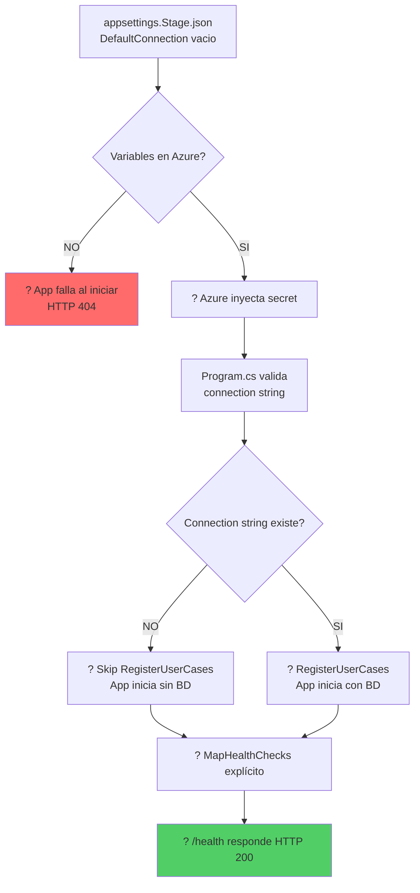

# ?? PROBLEMA: Health Check Falla con HTTP 404

## ? **Error Observado**

```
??  Verificando health check...
??  Health check retornó HTTP 404
##[error]Script failed with exit code: 1
```

---

## ?? **Causa Raíz**

El problema tiene **DOS causas**:

### **1. Connection String Vacío**

El archivo `appsettings.Stage.json` tiene el `DefaultConnection` vacío:

```json
{
  "DatabaseSettings": {
    "DefaultConnection": ""  // ? VACÍO
  }
}
```

**Problema:** 
- La aplicación intenta registrar `UserCases` con un `DatabaseSettings` que tiene un connection string vacío
- Esto puede causar que la aplicación falle al iniciar
- Si la app no inicia, el endpoint `/health` NO está disponible ? HTTP 404

---

### **2. Variables de Entorno NO Configuradas**

Las variables de entorno en Azure Container Apps **NO están configuradas** con el formato correcto:

**Necesitas:**
```
DatabaseSettings__DefaultConnection=secretref:db-connection-string
```

**Pero actualmente no existe o tiene formato incorrecto.**

---

## ? **Solución Implementada**

### **Cambio 1: Program.cs - Validar Connection String**

Se agregó validación para **solo registrar UserCases si el connection string está configurado**:

```csharp
// Obtener instancia de DatabaseSettings
var databaseSettings = builder.Configuration.GetSection("DatabaseSettings").Get<DatabaseSettings>();

// ? NUEVO: Solo registrar UserCases si el connection string está configurado
if (!string.IsNullOrEmpty(databaseSettings?.DefaultConnection))
{
    var serviceUserCase = builder.Services.RegisterUserCases(userCaseTypes, databaseSettings!);
}
```

**Esto evita:**
- Que la app falle al iniciar si no hay connection string
- Errores de conexión a BD durante el startup
- La app puede iniciar y responder en `/health` incluso sin BD

---

### **Cambio 2: Program.cs - Health Check Explícito**

Se movió el `MapHealthChecks("/health")` **ANTES** de `MapDefaultEndpoints()`:

```csharp
// ? NUEVO: Health check explícito PRIMERO
app.MapHealthChecks("/health");

// Luego los default endpoints de Aspire
app.MapDefaultEndpoints();
```

**Esto asegura:**
- El endpoint `/health` siempre está disponible
- Tiene prioridad sobre otros endpoints
- Funciona incluso si `MapDefaultEndpoints()` tiene problemas

---

### **Cambio 3: Script de Configuración Mejorado**

El script `configure-env-vars.ps1` ahora:

? **Detecta si el secret `db-connection-string` existe**
? **Ofrece crearlo interactivamente**
? **Pide el password de forma segura**
? **Configura todas las variables de entorno**

---

## ?? **Pasos para Resolver**

### **1. Ejecutar el Script de Configuración**

```powershell
cd .Deploy
.\configure-env-vars.ps1
```

**El script te preguntará:**
- ¿El secret `db-connection-string` existe? **NO**
- ¿Deseas crearlo? **Y**
- Ingresa el password de la BD: **[ingresa password de forma segura]**
- ¿Deseas continuar con la configuración? **Y**

**El script hará:**
1. ? Crear el secret con el connection string completo
2. ? Configurar `DatabaseSettings__DefaultConnection=secretref:db-connection-string`
3. ? Configurar `ASPNETCORE_ENVIRONMENT=Stage`
4. ? Configurar `UseCase__EnableDetailedTelemetry=false`

---

### **2. Hacer Commit y Push**

```bash
git add .
git commit -m "fix: agregar validación de connection string y health check explícito"
git push origin main
```

---

### **3. El Pipeline se Ejecutará Automáticamente**

```
1. Build de imagen Docker
   ?
2. Push a ACR
   ?
3. Deploy a Azure Container Apps
   ?
4. Azure inyecta las variables de entorno (incluyendo el secret)
   ?
5. La app inicia correctamente ?
   ?
6. Health check responde HTTP 200 ?
```

---

## ?? **Verificación Post-Deploy**

### **Verificar Variables**

```bash
az containerapp show \
  --name ca-platheotemplate-stg \
  --resource-group Platheo-tempalte \
  --query "properties.template.containers[0].env" \
  -o table
```

**Resultado esperado:**
```
Name                                 Value    SecretRef
-----------------------------------  -------  ---------------------
ASPNETCORE_ENVIRONMENT               Stage    
UseCase__EnableDetailedTelemetry     false    
DatabaseSettings__DefaultConnection           db-connection-string
```

---

### **Verificar Secrets**

```bash
az containerapp secret list \
  --name ca-platheotemplate-stg \
  --resource-group Platheo-tempalte \
  -o table
```

**Resultado esperado:**
```
Name
----------------------
db-connection-string
```

---

### **Probar Health Check**

```bash
# Obtener URL
APP_URL=$(az containerapp show \
  --name ca-platheotemplate-stg \
  --resource-group Platheo-tempalte \
  --query "properties.configuration.ingress.fqdn" \
  -o tsv)

# Probar health check
curl -v https://$APP_URL/health
```

**Resultado esperado:**
```
< HTTP/2 200
< content-type: text/plain
< 
Healthy
```

---

### **Ver Logs de la Aplicación**

```bash
az containerapp logs show \
  --name ca-platheotemplate-stg \
  --resource-group Platheo-tempalte \
  --follow
```

**Buscar en logs:**
```
info: Microsoft.Hosting.Lifetime[0]
      Now listening on: http://[::]:8080
info: Microsoft.Hosting.Lifetime[0]
      Application started. Press Ctrl+C to shut down.
info: Microsoft.Hosting.Lifetime[0]
      Hosting environment: Stage
info: Microsoft.Hosting.Lifetime[0]
      Content root path: /app
```

---

## ?? **Flujo Completo de Configuración**



---

## ?? **Resumen de Cambios**

| Archivo | Cambio | Razón |
|---------|--------|-------|
| `Program.cs` | Validar connection string antes de RegisterUserCases | Evitar fallo al iniciar sin BD |
| `Program.cs` | Health check explícito primero | Asegurar que `/health` siempre funciona |
| `configure-env-vars.ps1` | Crear secret interactivamente | Facilitar configuración inicial |
| `appsettings.Stage.json` | (Ya estaba vacío) | Correcto - se sobrescribe con variable |

---

## ?? **IMPORTANTE**

### **El problema NO es el `appsettings.Stage.json` vacío**

El connection string vacío es **correcto** y es parte de la solución (se sobrescribe con variable de entorno).

### **El problema ES la falta de configuración en Azure**

Sin la variable `DatabaseSettings__DefaultConnection=secretref:db-connection-string` configurada en Azure Container Apps, la aplicación:

1. ? Intenta registrar UserCases con connection string vacío
2. ? Puede fallar al iniciar
3. ? El endpoint `/health` no está disponible
4. ? Pipeline falla con HTTP 404

---

## ? **Después de Configurar**

Con la variable configurada:

1. ? Azure inyecta el connection string real desde el secret
2. ? `Program.cs` valida que existe
3. ? Registra UserCases correctamente
4. ? La app inicia sin problemas
5. ? `/health` responde HTTP 200
6. ? Pipeline pasa exitosamente

---

**Ejecuta el script `configure-env-vars.ps1` AHORA para resolver el problema.** ??
